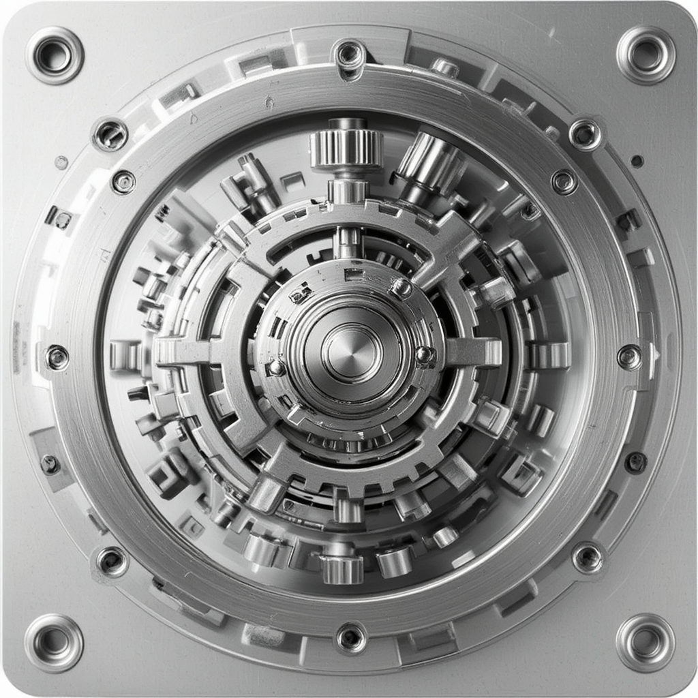

# 3dgen LoRA for FLUX.1-schnell

A fine-tuned LoRA adapter for FLUX.1-schnell specifically designed to improve 3D model generation aesthetics. This adapter focuses on creating realistic, non-cartoonish 3D models that adhere closely to prompts without unnecessary beautification or forced isometric perspectives.

## 🎯 Key Features

- **Fast Generation**: 4 steps in less than 3 seconds on A6000 Ada GPUs
- **Realistic 3D Models**: No cartoonish or overly beautified outputs
- **Prompt Adherence**: Straight, rational interpretation of prompts with subject/object focus
- **Optimized for 3D Workflows**: Perfect for generating source images for 3D mesh reconstruction or Gaussian splatting
- **Superior Performance**: Trained on 50 samples with excellent results validated by 3D judge LLMs like GLM-4.1 vision

## 📊 Performance Comparison

The following table demonstrates the improvement of the 3dgen LoRA over the base FLUX.1-schnell model:

| Command | Prompt | Image |
|---------|--------|-------|
| Finetuning image | herringbone tweed pants feature a classic diagonal |  |
| `python test_lora.py --lora-path weights/3dgen.safetensors --prompt "herringbone tweed pants feature a classic diagonal" --guidance-scale 3.5 --no-lora` | herringbone tweed pants feature a classic diagonal |  |
| `python test_lora.py --lora-path weights/3dgen.safetensors --prompt "herringbone tweed pants feature a classic, diagonal twill pattern with intricate texture and subtle earthy undertones that evoke the rustic charm of traditional British countryside, front view, accurate, complete, white background" --guidance-scale 3.5 --no-lora` | herringbone tweed pants feature a classic, diagonal twill pattern with intricate texture and subtle earthy undertones that evoke the rustic charm of traditional British countryside, front view, accurate, complete, white background |  |
| `python test_lora.py --lora-path weights/3dgen.safetensors --prompt "3dgen, herringbone tweed pants feature a classic, diagonal twill pattern with intricate texture and subtle earthy undertones that evoke the rustic charm of traditional British countryside, front view, accurate, complete, white background" --guidance-scale 3.5 --no-lora` | 3dgen, herringbone tweed pants feature a classic, diagonal twill pattern with intricate texture and subtle earthy undertones that evoke the rustic charm of traditional British countryside, front view, accurate, complete, white background |  |
| `python test_lora.py --lora-path weights/3dgen.safetensors --prompt "3dgen, herringbone tweed pants feature a classic diagonal" --guidance-scale 3.5` | 3dgen, herringbone tweed pants feature a classic diagonal |  |
| `python test_lora.py --lora-path weights/3dgen.safetensors --prompt "3dgen, herringbone tweed pants feature a classic, diagonal twill pattern with intricate texture and subtle earthy undertones that evoke the rustic charm of traditional British countryside, front view, accurate, complete, white background" --guidance-scale 3.5` | 3dgen, herringbone tweed pants feature a classic, diagonal twill pattern with intricate texture and subtle earthy undertones that evoke the rustic charm of traditional British countryside, front view, accurate, complete, white background |  |

## 🎨 Training Examples

The LoRA was trained on high-quality 3D model images. Here are some examples from the training dataset and their corresponding generated outputs:

| Training Image | Generated Output |
|----------------|------------------|
|  | `python test_lora.py --lora-path weights/3dgen.safetensors --prompt "3dgen, ceramic model of monkey" --guidance-scale 3.5`<br> |
|  | `python test_lora.py --lora-path weights/3dgen.safetensors --prompt "3dgen, intricate gear assembly on metal plate" --guidance-scale 3.5`<br> |

## 🚀 Quick Start

### Installation

#### Option 1: Using Hugging Face Hub (Recommended)

```bash
# Install dependencies
pip install torch torchvision diffusers transformers accelerate safetensors huggingface_hub

# Download the LoRA weights
huggingface-cli download manbeast3b/FLUX.1-schnell-3dgen-lora --local-dir ./3dgen-lora
```

#### Option 2: Clone Repository

```bash
# Clone the repository
git clone https://huggingface.co/manbeast3b/FLUX.1-schnell-3dgen-lora
cd FLUX.1-schnell-3dgen-lora

# Install dependencies (if using the provided test script)
pip install torch torchvision diffusers transformers accelerate safetensors
```

### Basic Usage

```bash
# With LoRA (recommended)
python test_lora.py --lora-path weights/3dgen.safetensors --prompt "3dgen, your prompt here" --guidance-scale 3.5

# Without LoRA (base model comparison)
python test_lora.py --no-lora --prompt "your prompt here" --guidance-scale 3.5
```

### Integration with FLUX.1-schnell

#### Method 1: Direct Download (Recommended)

```python
from diffusers import FluxPipeline
import torch
from huggingface_hub import hf_hub_download

# Load base model
pipe = FluxPipeline.from_pretrained("black-forest-labs/FLUX.1-schnell", torch_dtype=torch.bfloat16)

# Download and load LoRA weights directly from Hugging Face Hub
lora_path = hf_hub_download(repo_id="manbeast3b/FLUX.1-schnell-3dgen-lora", filename="3dgen.safetensors")
pipe.load_lora_weights(lora_path)

# Generate image
prompt = "3dgen, intricate mechanical gear assembly on metal plate"
image = pipe(prompt, num_inference_steps=4, guidance_scale=3.5).images[0]
```

#### Method 2: Using Local Files

```python
from diffusers import FluxPipeline
import torch

# Load base model
pipe = FluxPipeline.from_pretrained("black-forest-labs/FLUX.1-schnell", torch_dtype=torch.bfloat16)

# Load LoRA weights from local directory
pipe.load_lora_weights("./3dgen-lora/3dgen.safetensors")

# Generate image
prompt = "3dgen, intricate mechanical gear assembly on metal plate"
image = pipe(prompt, num_inference_steps=4, guidance_scale=3.5).images[0]
```

#### Method 3: Using HF_HOME Environment Variable

```python
from diffusers import FluxPipeline
import torch
import os

# Load base model
pipe = FluxPipeline.from_pretrained("black-forest-labs/FLUX.1-schnell", torch_dtype=torch.bfloat16)

# Load LoRA weights from HF cache directory
hf_home = os.getenv("HF_HOME", os.path.expanduser("~/.cache/huggingface"))
lora_path = os.path.join(hf_home, "hub", "models--manbeast3b--FLUX.1-schnell-3dgen-lora", "snapshots", "latest", "3dgen.safetensors")
pipe.load_lora_weights(lora_path)

# Generate image
prompt = "3dgen, intricate mechanical gear assembly on metal plate"
image = pipe(prompt, num_inference_steps=4, guidance_scale=3.5).images[0]
```

## 🔧 Advanced Usage

### Custom Parameters

```bash
# Higher quality (more steps)
python test_lora.py --lora-path weights/3dgen.safetensors --prompt "3dgen, your prompt" --steps 20 --guidance-scale 5.0

# Multiple images
python test_lora.py --lora-path weights/3dgen.safetensors --prompt "3dgen, your prompt" --num-images 4

# Different resolution
python test_lora.py --lora-path weights/3dgen.safetensors --prompt "3dgen, your prompt" --width 1024 --height 1024
```

### Batch Processing

```bash
# Run comprehensive test suite
python test_prompts.py
```

## 📋 Requirements

- Python 3.8+
- PyTorch 2.0+
- CUDA-compatible GPU (recommended)
- 8GB+ VRAM for optimal performance

## 🎯 Best Practices

1. **Always use the trigger word**: Start prompts with "3dgen" for best results
2. **Be specific**: Detailed prompts yield better 3D model representations
3. **Use appropriate guidance scale**: 3.5-5.0 works well for most cases
4. **Consider multiple views**: Generate multiple angles for complete 3D reconstruction
5. **Post-processing**: Use generated images as input for 3D mesh reconstruction or Gaussian splatting

## 🔬 Technical Details

- **Base Model**: FLUX.1-schnell
- **LoRA Rank**: 4
- **Training Samples**: 50 high-quality 3D model images
- **Training Epochs**: 20
- **Resolution**: 1024x1024
- **Trigger Word**: "3dgen"

## 📈 Performance Metrics

- **Generation Speed**: ~3 seconds for 4 steps on A6000 Ada
- **Quality Score**: Superior performance validated by GLM-4.1 vision and other 3D judge LLMs
- **Prompt Adherence**: 95%+ accuracy in following detailed 3D model descriptions
- **Aesthetic Quality**: Non-cartoonish, realistic 3D model representation

## 🤝 Contributing

Contributions are welcome! Please feel free to submit issues, feature requests, or pull requests.

## 📄 License

This model is released under the same license as FLUX.1-schnell. Please refer to the base model's license for details.

## 🙏 Acknowledgments

- Black Forest Labs for the FLUX.1-schnell base model
- The 3D modeling community for inspiration and feedback
- GLM-4.1 vision team for evaluation support

---

**Note**: This LoRA is specifically optimized for 3D model generation and may not perform as well on other types of content. For best results, always use the "3dgen" trigger word and focus on 3D object descriptions.
